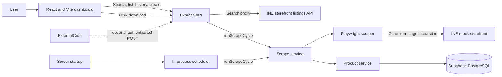
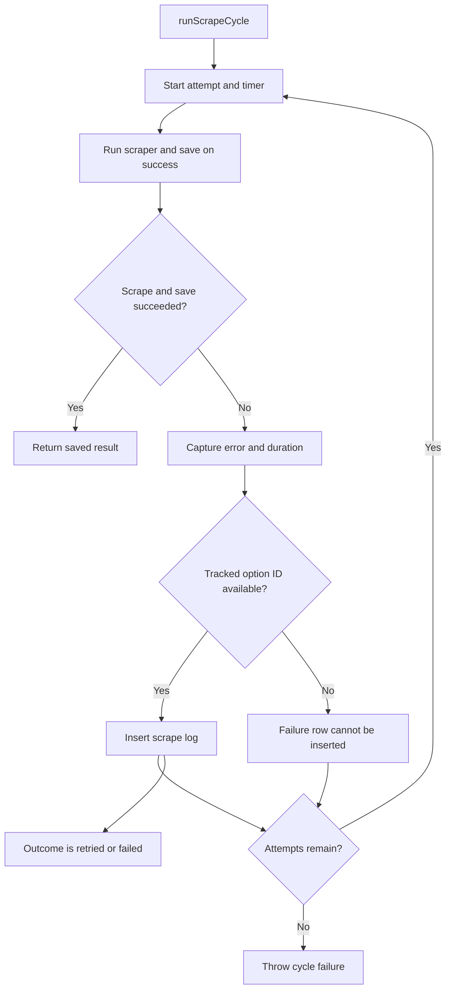
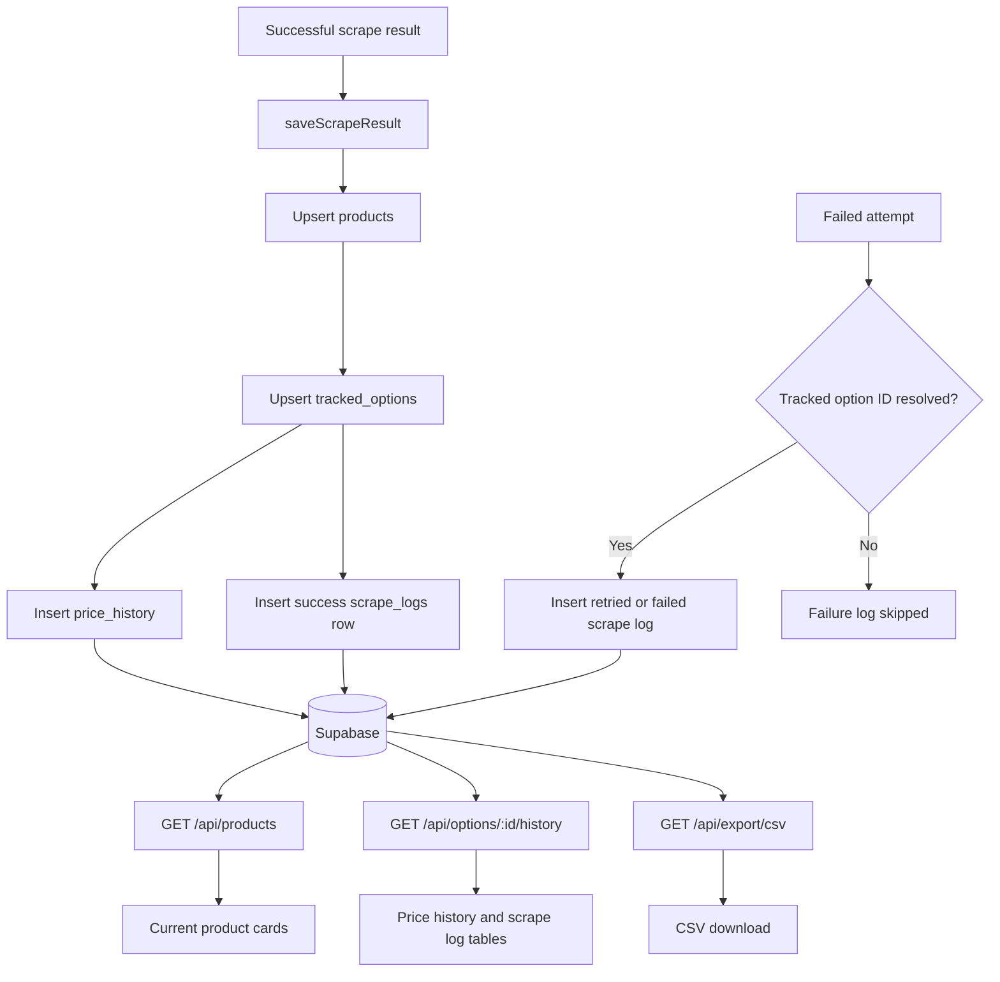

# INE Product Price Tracker - Design and Engineering Note

## 1. Overview

INE Product Price Tracker is a full-stack application for searching products in the INE-hosted mock storefront, selecting an option, and recording its price and availability in Supabase. The React dashboard presents tracked products, current stored values, per-option history, scrape attempts, and a CSV export.

The implementation combines a Vite/React frontend, a Node.js/Express API, Playwright browser automation, and Supabase persistence. This note describes the repository as it exists; it does not assume that a hosting provider or external cron job has been configured.

## 2. System Architecture

The browser calls the Express API for product search, tracking, saved products, option history, and CSV export. The backend queries Supabase and runs the scraper against the storefront. The API is defined inline in `backend/src/server.js`; `src/routes/scraperRoutes.js` is not the active route implementation.



The external trigger is implemented as an API endpoint, but no external scheduler configuration is included in the repository.

## 3. Product Search Flow

The frontend search form calls `GET /api/search?q=...`. The backend fetches paginated listings from the storefront, caches the combined list in process memory for five minutes, filters case-insensitively by product name or description, and returns at most ten matches. Empty queries and no-match queries return an empty `results` array. The current UI does not show a dedicated no-results message.

```mermaid
flowchart TD
	User[Enter partial or full name] --> Form[AddProduct search form]
	Form -->|GET /api/search?q=...| API[Express search endpoint]
	API --> Cache{Five-minute listing cache valid?}
	Cache -->|Yes| Listings[Cached listings]
	Cache -->|No| Fetch[Fetch paginated storefront listings]
	Fetch --> SaveCache[Cache listing results]
	SaveCache --> Listings
	Listings --> Match[Match name or description; take first ten]
	Match --> Results{Any results?}
	Results -->|No| Empty[Return results: []]
	Results -->|Yes| Select[User selects a result]
	Select --> URL[Set URL from storefront product ID]
	URL --> Option[User enters option name]
	Option --> Track[Submit tracking request]
	Track -->|POST /api/products| API
```

Selecting a result fills the product URL using its storefront ID. The option name is entered as text; the frontend does not load an option list as part of search.

## 4. Scraping Strategy

`scrapeProduct()` launches Chromium headlessly and opens the supplied URL with Playwright's `domcontentloaded` condition and a 30-second navigation timeout. It extracts the store product ID from an `/item/{id}` URL and reads the first page `h1` for the product name. If an option was supplied, it finds and clicks a matching option chip.

The page renders its price and stock dynamically, so the scraper interacts with the real page rather than treating the initial HTML as final. It handles the consent scrim, moves the pointer across the offer message to unlock the Check Price button, and waits for the button to enable before clicking. Price resolution polls the offer panel, rejects locked/loading states, hidden or struck-through candidates, and values without a currency marker, then chooses the largest-font visible candidate. It strips zero-width characters and whitespace before deriving the numeric INR amount.

Stock is read from visible panel text while ignoring hidden and struck-through content. The current parser recognizes `SOLD OUT`, `AVAILABLE`, `READY TO SHIP`, `REMAINING`, and `LAST FEW`; the count remains null when a numeric count cannot be parsed. The option group is currently set to `Color`, while brand and SKU are returned as null. These are implementation constraints, not dynamically discovered metadata.

`backend/src/scraper/inspectProduct.js` is a separate headed inspection utility with a sample product URL and slow motion. The application scraper itself always launches headless Chromium.

## 5. Reliability and Retry Strategy

`runScrapeCycle()` defaults to three attempts. It measures each attempt and catches both scraping and save errors before proceeding immediately to the next attempt. There is no delay or exponential backoff in this active service. `backend/src/utils/retry.js` contains a jittered exponential retry helper, but the active scrape service does not call it.

Failure logging requires a tracked-option ID. The service accepts an explicit ID or tries to find an existing option by product URL and option value. If it cannot resolve an ID, it logs the lookup problem but cannot write a failure row because `scrape_logs.tracked_option_id` is required. A new product whose first scrape fails before it has been saved can therefore have no persisted failure row.



The outcome is `retried` when another attempt will run and `failed` on the final attempt. A separate `success` log is written by the product service after a successful save. The helper in `utils/retry.js` should not be mistaken for the retry policy used by `runScrapeCycle()`.

## 6. Scrape History and Logging

Successful persistence upserts the product and tracked option, inserts a `price_history` row, and inserts a `scrape_logs` row with the cycle key, attempt number, price, stock values, and duration. A failed attempt uses `saveScrapeFailure()` to record its error type, message, duration, and `retried` or `failed` outcome when the tracked-option ID is known.

The option-history endpoint returns price-history rows and scrape-log rows for a tracked option. The dashboard shows timestamps, attempt number, outcome, and successful price/stock values. Failed and retried rows remain visible with blank price/stock display. Although failure error fields are stored, the current history endpoint does not select them and the UI does not display them.

## 7. Price and Stock History

Price and stock snapshots are inserted into `price_history` after successful scraping and are associated with a tracked option. `GET /api/products` returns saved products, active tracked options, and the latest related price-history row for each option. The frontend uses that response for the current card values and calls `GET /api/options/:id/history` for the full history and log tables.



The UI displays the current stored price, stock status/count when available, and last-checked/last-updated timestamps. It presents chronological records as returned by the API; it does not calculate or draw a price chart.

## 8. CSV Export

The dashboard's Export CSV link downloads `GET /api/export/csv` as `scrape_history.csv`. The endpoint joins scrape logs to tracked options and products and returns these columns:

| Column | Source |
|---|---|
| `store_product_id` | Last segment of the saved product URL |
| `product_name` | Product row |
| `selected_option` | Tracked option row |
| `timestamp` | `attempted_at`, formatted as UTC ISO 8601 |
| `price` | Scrape log price for successful outcomes |
| `stock` | Scrape log stock status for successful outcomes |
| `outcome` | Scrape log outcome |

For non-success outcomes the CSV writes blank price and stock fields while preserving the outcome. The export currently includes stock status, not stock count.

## 9. Scheduling

`server.js` starts `scraperScheduler` when the backend process starts. The scheduler runs one cycle immediately and then uses a two-hour in-process interval. It selects active tracked options and scrapes them sequentially. Although the query also selects `scrape_interval_minutes`, the active scheduler uses the single global two-hour interval rather than each row's value. Successful cycles compare the two most recent stored prices and print a price-change message to the backend log.

`POST /api/scheduler/run` is an authenticated asynchronous trigger. It accepts a Bearer token or a `secret` query parameter and compares it with `SCHEDULER_SECRET`. The response confirms that a cycle was triggered; it does not wait for the cycle to finish. No external cron provider or deployed schedule is configured or verified here. An in-process timer cannot run while its host process is stopped or asleep.

## 10. Engineering Trade-offs

- Playwright exercises the storefront's rendered state and interactions, but is heavier than a direct HTTP parser and remains sensitive to storefront markup changes.
- The search proxy downloads and caches storefront listings in memory to support substring matching. The cache is process-local, lasts five minutes, and is rebuilt independently by each backend instance.
- Product identity is derived from the `/item/{id}` URL. Product name is read from the page, while brand and SKU are placeholders in the current result model.
- Price and stock are parsed from rendered text and DOM visibility. This avoids storing obvious hidden/struck-through prices but depends on the target page's current structure and labels.
- The scheduler is intentionally simple: sequential work in one Node process and a fixed two-hour interval. It is not a durable job queue.
- Database writes are performed as separate Supabase operations rather than as one transaction.

## 11. What Went Wrong During Development

Early diagnostics treated the absence of the word `loading` as evidence that the panel had settled. A locked panel saying `Price locked` therefore passed too early. The wait was revised to check panel state and visible price content rather than treating any non-loading text as success.

The Check Price control also depended on hover behavior across the actual offer-message region, not just a button selector or a single wait. Playwright's consent scrim could remain in the DOM after acceptance, so presence alone was not a reliable signal that it still blocked interaction. The current code checks computed styles and dialog state before continuing.

Another important Playwright detail was that `page.waitForFunction()` returns a `JSHandle`; obtaining its string requires calling `jsonValue()`. Price extraction also needed to avoid hidden or struck-through values and choose the visible selling price rather than an alternate price row. These details are encoded in the current scraper, but storefront changes can require renewed inspection.

## 12. AI Usage

AI coding assistance was used during development to inspect project structure, help draft and revise implementation changes, and prepare project documentation. Suggestions were grounded against the active source and checked with syntax checks, the frontend production build, and manual storefront/database scripts where available. AI assistance does not verify the live storefront, Supabase project, Vercel/Render deployment, or an external cron configuration; those remain environment-dependent checks.

## 13. Security and Secrets

The backend requires `SUPABASE_URL` and `SUPABASE_SECRET_KEY`; these credentials must remain server-side and must never be placed in a `VITE_` variable or committed to Git. `SCHEDULER_SECRET` protects the scheduler trigger. Prefer the Authorization Bearer header over a query parameter so the secret is less likely to appear in URL logs. The current `.env.example` names `SUPABASE_SERVICE_ROLE_KEY`, but the active source reads `SUPABASE_SECRET_KEY`; local configuration must use the name expected by the source.

The current Express setup uses permissive `cors()` and does not authenticate the product/search/history/CSV endpoints. The scheduler endpoint is the exception. The product-scrape endpoint accepts a caller-provided URL and the scraper navigates to it after extracting an item ID; the current code does not enforce a storefront-host allowlist. These behaviors should be reviewed before exposing the backend publicly.

## 14. Deployment

The frontend is a Vite build and can be served as static assets; the backend is an Express process that reads `PORT` and starts its scheduler at process boot. Vercel is the intended frontend target and Render the intended backend target, but this repository contains no provider configuration and does not establish that either deployment is active.

For a hosted setup, the frontend needs `VITE_API_URL` pointed at the backend origin. The backend needs its Supabase credentials and, if an external trigger is used, `SCHEDULER_SECRET`. An external scheduler must be configured separately to call `POST /api/scheduler/run`; that configuration is not present here. A sleeping or stopped backend will not execute its in-process interval until it runs again.

## 15. Conclusion

The current implementation provides a working path from storefront search and product selection through browser scraping, Supabase persistence, history/log display, CSV export, and recurring scrape attempts. Its retries, selector logic, stock parsing, scheduler, and hosting remain deliberately straightforward and have known limits described above. Reliable operation depends on the storefront's current DOM, valid Supabase configuration, and a continuously running backend or a separately configured external trigger.
