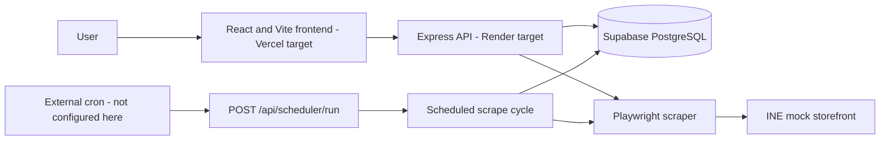
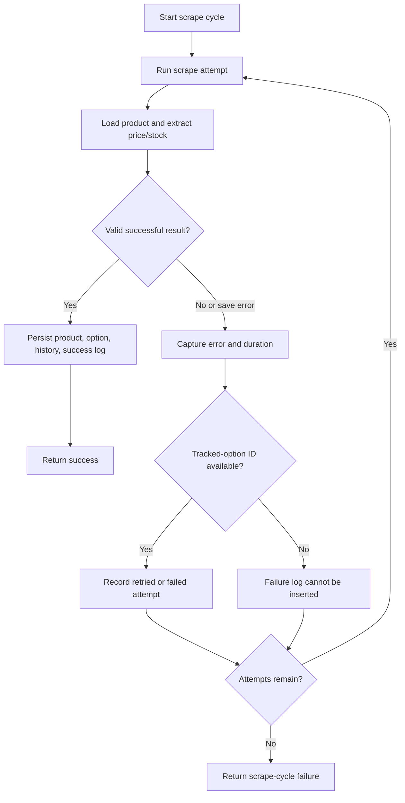

# INE Product Price Tracker

INE Product Price Tracker searches the INE-hosted mock storefront and tracks the price and availability of a selected product option. It uses a React dashboard, an Express API, Playwright for browser-based scraping, and Supabase for persistence.

## Demo

[**▶️ Watch the scraper demo**](https://drive.google.com/file/d/1sEBLsstKfdfvUPyQboS9_o0a6IxgBull/view?usp=drive_link)

## Architecture

The frontend and backend are intended for Vercel and Render respectively; this repository does not verify either deployment. An external cron provider is also not configured here.



## Scraping & Reliability

- Playwright is used because product options, consent, price, and stock are rendered in the browser.
- The scraper selects the requested option and extracts a visible selling price and stock status/count from the offer panel.
- `runScrapeCycle()` retries up to three times by default. Attempts are immediate; the separate backoff helper is not used by this service.
- Failed attempts are recorded as `retried` or `failed` when a tracked-option ID is available. First-time products without an existing option may have no failure log.
- A scrape error or missing visible price does not enter the success-save path. Successful database writes are separate operations, not a single transaction.



## Dashboard

- Search by partial or full product name; choose a result or paste a product URL, then enter an option name.
- View tracked products with current stored price and stock information.
- Open per-option price history and scrape logs.
- Download scrape history from the **Export CSV** link.

## Scheduling

The backend runs a scrape cycle at startup and repeats every two hours. `POST /api/scheduler/run` provides an authenticated trigger for an external scheduler, but no external cron configuration is included or verified. The in-process interval cannot run while the backend process is stopped or asleep.

## Local Development

Install dependencies and Chromium for Playwright:

```bash
cd backend
npm install
npx playwright install chromium
```

Create `backend/.env` with `SUPABASE_URL` and `SUPABASE_SECRET_KEY`. Optionally set `PORT` (defaults to `3000`) and `SCHEDULER_SECRET` (for the scheduler trigger). Never commit real secret values to Git. The example file currently names `SUPABASE_SERVICE_ROLE_KEY`; the active code expects `SUPABASE_SECRET_KEY`.

Start the backend with `npm run dev` or `npm start`. In a second terminal:

```bash
cd frontend
npm install
npm run dev
```

Set frontend `VITE_API_URL` when the backend is not at `http://localhost:3000`. Build the frontend with `npm run build` from `frontend/`.

For implementation details, constraints, and development notes, see [DESIGN_NOTE.md](DESIGN_NOTE.md).
